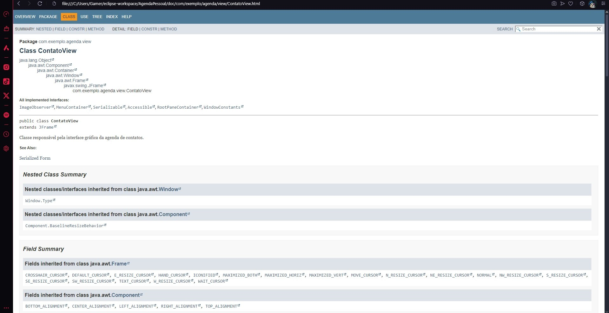

# AGENDA PESSOAL

Esta atividade é requisito da Avaliação Final 

## 🚀 Começando

*CRIE O PROJETO AGENDA PESSOAL;

*COMPILE O PROJETO E SE CERTIFIQUE QUE O MESMO ESTÁ EM FUNCIONAMENTO;

*GERE O JAVADOC DO PROJETO;

[Foto do Documento Java que foi criado]

()

### 📋 Pré-requisitos

De que coisas você precisa para instalar o software e como instalá-lo?

*Java JDK.

*IDE Eclipse ou qualquer outra IDE.

*MySQL para ter um banco de dados.

*Driver JDBC Para conexão com o banco de dados.

### 🔧 Instalação

Após abrir o pacote com o Arquivo para o programa executar, entre no Arquivo AgendaContatos e execute-o, a partir disso, utilize os números de 1 a 5 para selecionar a opção desejada e siga utilizando os métodos do projeto para se ter uma lista de contatos cadastradas no seu programa

## 🛠️ Construído com

* IDE Eclipse
* JRE System Library
* Maven Dependencies
* WAMP SERVER 

## 📌 Versão

* **Eclipse Installer 2024-09 R
* Wamp Server 3.3.5
  
